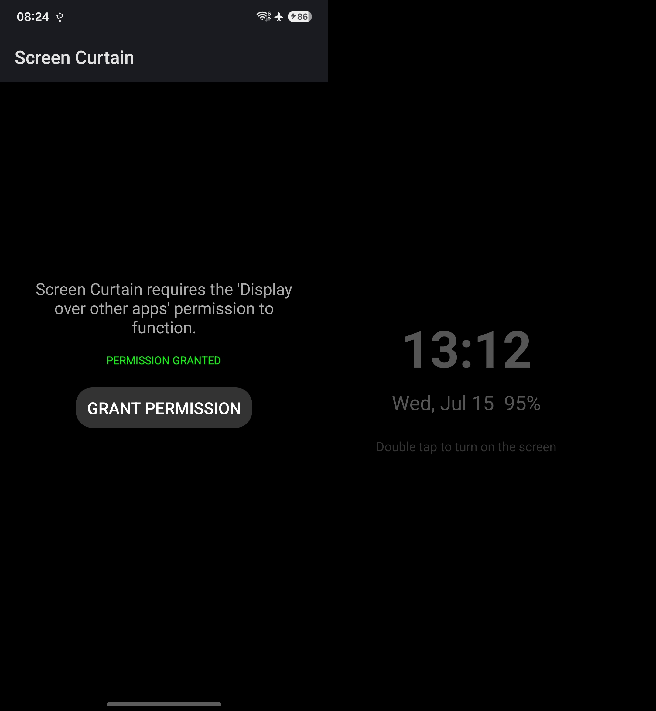

# Screen Curtain

An alternative to Samsung Screen Curtain. Tap a Quick Settings tile to add a black curtain over the entire screen, helping prevent accidental touches but still keep focus on the current application.

## Image

## Usage
1. Click `GRANT PERMISSION` and grant the permission.
2. Add `Screen Curtain` tile to the Quick Settings panel.
3. Tap the tile to enable the overlay.
4. Double-tap anywhere on the screen to dismiss the overlay.

## Permissions
- `SYSTEM_ALERT_WINDOW`
- `BIND_QUICK_SETTINGS_TILE`

## Disclaimer
- The code is entirely generated by AI and may not have been reviewed by a human.
- Tested only on Android 15 and 16; it may not work properly on older or newer versions of Android.
